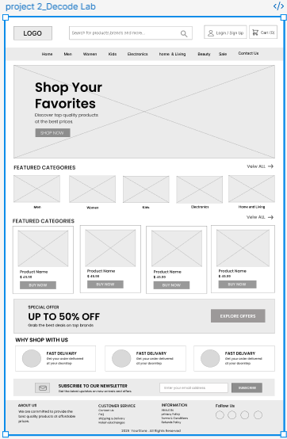
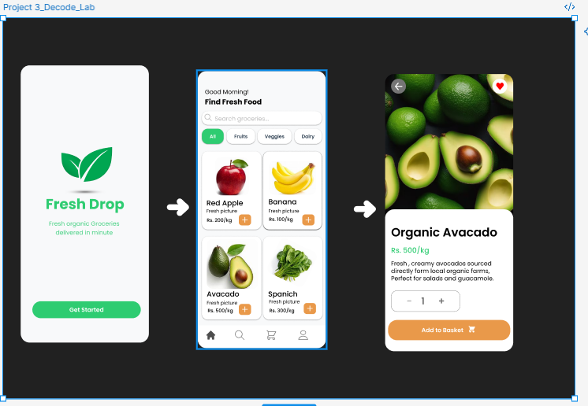

# DecodeLabs UI/UX Internship Projects

This repository contains the UI/UX design projects that I completed during my DecodeLabs Internship.

---

## Project 1 - Fitness App Empathy Map

### Preview

### PDF

[View Project 1 PDF](./decode%20lab%20-%20Project%201.pdf)

### Figma

[Open Project 1 in Figma](https://www.figma.com/design/DQKU6qhrx4sd0uql0SD3xq/project-1_DECODE-LAB?node-id=122-1767&t=pcDcZ9mW27GqwbCI-1)

---

## Project 2 - E-Commerce Website Wireframe

### Preview

### PDF

[View Project 2 PDF](./decode%20lab%20-%20Project%202.pdf)

### Figma

[Open Project 2 in Figma](https://www.figma.com/design/FyImAuDrSa31zeh5zGUTue/project-2_DECODE-LAB?node-id=2-6&t=wISgBS5TWrwDTHit-1)

---

## Project 3 - Organic Food Delivery App

### Preview

### PDF

[View Project 3 PDF](./Project%203_Decode_Lab.pdf)

### Figma

[Open Project 3 in Figma](https://www.figma.com/design/FyImAuDrSa31zeh5zGUTue/project-2_DECODE-LAB?node-id=2-214&t=wISgBS5TWrwDTHit-1)

---

## Tools Used

- Figma
- Wireframing
- UI Design
- Prototyping

---

## Created By

**Gittiqa Maheshwari**

BS Computer Science Student  
UI/UX Design Intern at DecodeLabs
